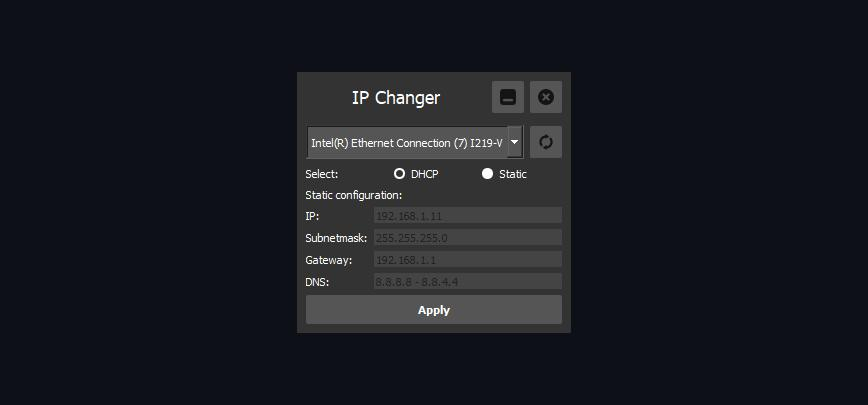

# IP Changer

### About it

Small tool for Windows OS, that allow you change your ethernet adapters configuration.

### Preview

### Build

Using PyInstaller

`pyinstaller .\IPChanger.spec`

### Tools

- Pycharm
- PyQt 5
- WMI